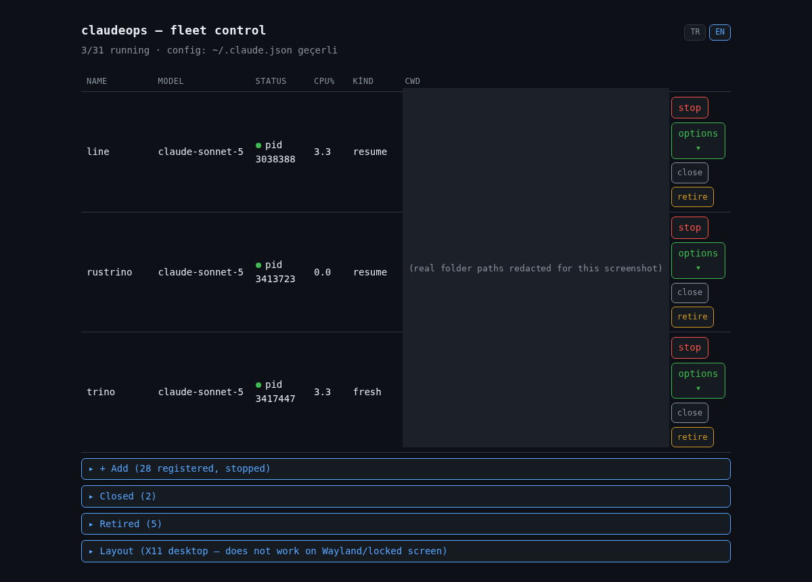
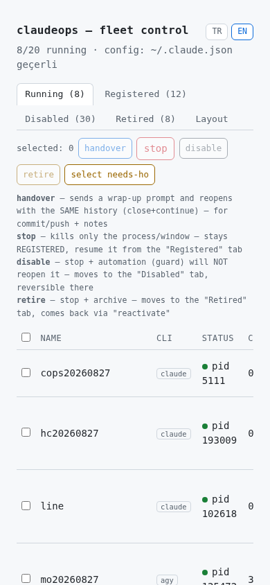

# claudeops — Python (`py/cops`)

*[English](README.md) · Türkçe*

Birden fazla proje klasöründe, birden fazla Claude Code oturumunu tek yerden yönetmek için
küçük bir CLI + yerel web paneli. Her proje bir "roster" satırı (isim → klasör → model);
`py/cops web` bu roster'ı gösterip tek tek başlatma/durdurma sağlar.

Linux + X11 gerekir (`gnome-terminal`'e bağımlı) — WSL/headless/macOS/Windows desteklenmiyor.

## Kurulum

```bash
git clone https://github.com/mfyuce/claudeops.git
cd claudeops
pip install -r py/requirements.txt   # tek bağımlılık: psutil
```

Python 3.10+. `claude` CLI kurulu ve PATH'te olmalı.

## Hızlı başlangıç

```bash
py/cops list          # şu an çalışan session'ları göster
py/cops web            # kontrol paneli → http://127.0.0.1:8765
py/cops web --tunnel   # + telefondan/uzaktan erişim (cloudflared, ilk seferde otomatik kurulur)
```

## `py/cops web` — kontrol paneli

En kolay kullanım yolu; her şey tarayıcıdan:



- **Ana sayfa** — sadece o an **çalışan** session'lar (gürültüsüz; hiçbir şey otomatik açılmaz).
- **+ Ekle** — kayıtlı-ama-kapalı projeleri listeler; birini seçip **devam ettir** / **sıfırla (--new)** /
  **ayrı yeni chat aç** (otomatik tarih-isimli, model/permission-mode/effort seçenekli) ile başlatırsınız.
  Aynı panelin altında **yeni proje kaydet** formu (isim + klasör + model) — elle dosya düzenlemeden
  roster'a ekler.
- **Kapalı / Emekli** — geçici durdurulmuş / tamamen bırakılmış projeler; "tekrar işe al"la geri gelir.
  Aktif bir projeyi **kapat**mak (geçici) ya da **emekli et**mek (kalıcı) mümkün.
- **Handover** — çalışan bir session'a wrap-up mesajı gönderir (dokümanları güncelle, commit+push et),
  aynı geçmişle (`--resume`) + bu mesaj ilk mesaj olarak yeniden başlatır. Panel o an hangi dildeyse
  mesaj da o dilde gider.
- **Layout** — pencereleri masaüstlerine dağıtır (`wmctrl`+`xdotool`, X11 only). Kilitli ekranda veya
  Wayland'da bozuk çalıştığı bilindiği için **otomatik pre-flight kontrol** var — kilitliyse reddeder.
  Eksik bağımlılık varsa (Ubuntu/Debian: `sudo apt install -y wmctrl xdotool`) uyarır, kurmaz (sudo gerektirir).
- **TR/EN** — tarayıcı diline göre otomatik seçilir (`navigator.language`), sağ üstteki butonlarla elle
  değiştirilip kalıcı hale getirilebilir (localStorage).
- **Token korumalı** (`~/.claude/claudeops/web.token`, ilk çalıştırmada rastgele üretilir) — sayfa da
  API de token olmadan 401 döner. `--tunnel` ile `cloudflared` quick-tunnel açılır (PATH'te yoksa
  `~/.local/bin`'e otomatik indirilir, Linux amd64/arm64).

### Telefondan erişim



Tablo dar ekranlarda uyum sağlıyor (model/tür sütunları gizlenir, action butonları kaydırmadan
erişilebilir kalır).

```bash
py/cops web --tunnel
```

Bu iki URL yazdırır:

```
claudeops web  →  http://127.0.0.1:8765/?token=<token>
  tünel  →  https://random-words-here.trycloudflare.com/?token=<token>
```

**İkinci URL** (`trycloudflare.com`) internet olan her yerden çalışır — VPN gerekmez, telefonun
bilgisayarla aynı Wi-Fi'de olmasına gerek yok. O URL'i (aynen) telefonunuza ulaştırın (kendinize
not/mesaj olarak gönderin, ya da [`qrencode`](https://packages.debian.org/search?keywords=qrencode)
kuruluysa `qrencode -t ansiutf8 "<url>"` ile terminalde taranabilir bir QR kod bastırın — Ubuntu/Debian:
`sudo apt install -y qrencode`; her şey lokalde kalır, URL üçüncü bir servise gitmez) ve telefonun
tarayıcısında açın.

Bilinmesi gerekenler:
- **Token** her yeniden başlatmada aynı kalır (aynı `~/.claude/claudeops/web.token` dosyası), ama
  **tünel URL'i her `--tunnel` çalıştırmasında değişir** — Cloudflare'in "quick tunnel"ı bu, hesap ya da
  domain gerektirmez ama sabit adresi de yoktur. Tünelin ayakta kalması için terminali açık tutun (ya da
  arka planda çalıştırın, ör. `tmux`/`nohup` ile).
- Token'lı tam URL'i ("?token=..." dahil) şifre gibi düşünün — kimde bu varsa session'larınızı
  başlatıp durdurabilir. Herkese açık paylaşmayın, ekran paylaşımında görünür bırakmayın.
- Her seferinde değişmeyen bir URL isterseniz, `--tunnel`'ın quick-tunnel'ı yerine kendi domain'inizde
  bir Cloudflare **named tunnel** kurmanız gerekir — claudeops bunu varsayılan olarak kurmuyor.

**Telefondan bir session'a ulaşmanın ikinci, bağımsız bir yolu daha var:** claudeops'un açtığı her
session `--remote-control` kullanıyor — bu Claude Code'un kendi yerleşik özelliği, dolayısıyla resmi
**Claude mobil uygulamasında** da **Code** sekmesi altında canlı bir bağlantı olarak görünür, direkt
dokunup konuşabilirsiniz (claudeops yok, tünel yok — bu tamamen Anthropic'in kendi altyapısı). claudeops
web paneli *hangi session'ların var olduğunu* yönetmek içindir (başlat/durdur/kaydet/layout); Claude
uygulamasının Code sekmesi ise *zaten çalışan biriyle konuşmak* içindir. Birlikte kullanmak pratik.

## CLI komutları

```
py/cops list      # çalışan session'ları listele
py/cops kill      # bir/birkaç session'ı nazikçe kapat (SIGTERM + grace + gerekirse SIGKILL)
py/cops close     # kalıcı kapat (kill + guard bir daha açmasın diye işaretle)
py/cops guard     # roster'daki eksik session'ları tespit edip aç (crash-recovery; cron'a konabilir)
py/cops rc        # kill + yeniden aç (tek tek ya da toplu; handover/respawn için)
py/cops handover  # session'ı wrap-up mesajıyla kapatıp aynı adla yeniden aç
                   #   isimsiz = tüm fleet (batch, co/ulaksec hariç); İSİM verilirse
                   #   tek session, roster gerekmez, co/ulaksec dahil; --lang=en
py/cops stuck     # takılı kalmış (idle ama "busy" görünen) session'ları tespit et
py/cops layout    # pencereleri masaüstlerine dağıt (X11)
py/cops web       # kontrol paneli (yukarıda)
```

Her komutun kendi `--help`'i var.

## Nasıl çalışır

- **Roster** iki TSV dosyası, repo dışında (`~/.claude/claudeops/`, kişiye özel, hiçbir zaman commit
  edilmez): `roster.tsv` (`isim<TAB>klasör<TAB>model`) ve `models.tsv` (`isim<TAB>model` — satır `#` ile
  başlıyorsa o isim kapalı/emekli, guard onu açmaz).
- Session'lar `gnome-terminal` içinde `claude -n İSİM --remote-control İSİM` ile açılır — Claude Code'un
  kendi Remote Control özelliği (claude.ai/code veya mobil uygulamadan da erişilebilir).
- Kill her zaman **SIGTERM + ~10 saniye bekleme + hâlâ canlıysa SIGKILL** — Claude Code'un transkript
  kaydı ara ara diske yazıldığı için (lazy-checkpoint), çok hızlı `SIGKILL` konuşma geçmişini kesebiliyor.
- `guard` opsiyonel — istemiyorsanız hiç kurmayın, tamamen `py/cops web`'den elle yönetin.

## Klasör yapısı

```
py/claudeops/
  paths.py, session.py, discovery.py   # temel: yollar, veri modeli, proc keşfi (psutil)
  spawn.py, kill.py, guard.py, layout.py, roster.py, handover.py, needs_ho.py, config.py, stuck.py
  commands/                             # her CLI komutu kendi dosyasında (web.py en büyüğü)
cops                                    # giriş noktası → python3 -m claudeops
```

## Tasarım notları

- **psutil, `ps|grep` değil** — cmdline liste olarak geliyor, quoting/anchor tuzağı yok.
- **CPU birinci sınıf aktiflik sinyali** — Claude Code'un kendi `status`/bridge alanları gecikmeli
  güncelleniyor, CPU%>2 daha güvenilir "gerçekten çalışıyor" göstergesi.
- **Bash `claudeops`** (repo kökünde) hâlâ duruyor ama artık sadece eski/legacy komutlar için —
  canlı fleet yönetiminin (guard, rc, handover, web) tamamı bu Python sürümünde.
